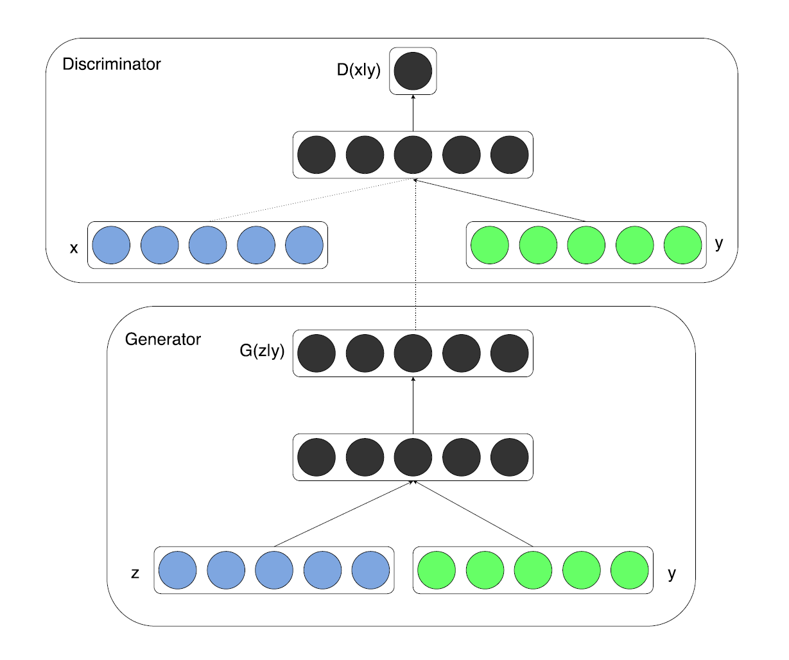
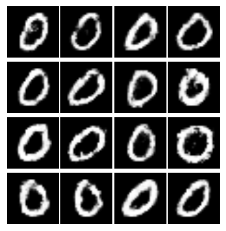
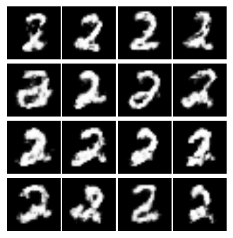
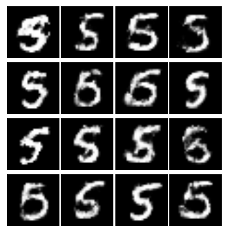
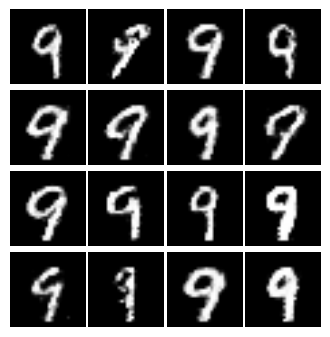
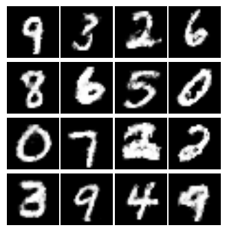

# Conditional Generative Adversarial Nets

# Requirements:    
   python3.5(2.7) + tensroflow(>1.0) + cv2   

# model   
        
      
# File describe    
   cgan_tensorflow.py: main function    
   test/*: test results     
   model/*: model after about 1000000 iterations

# Parameters   
   "iter": "Iteration to train [1000000]"     
   "batch_size": "The size of batch images [64]"     
   "model_path": "Save model path ['./model/cgan.model']"     
   "is_train": "Train or test [False]"     
   "test_number": "The number that want to generate, if None, generate randomly [None]"     

# Train step:    
   python cgan_tensorflow.py --is_train True     

# Testing step:    
   python cgan_tensorflow.py --test_number 0     
      
       
       
       
   

